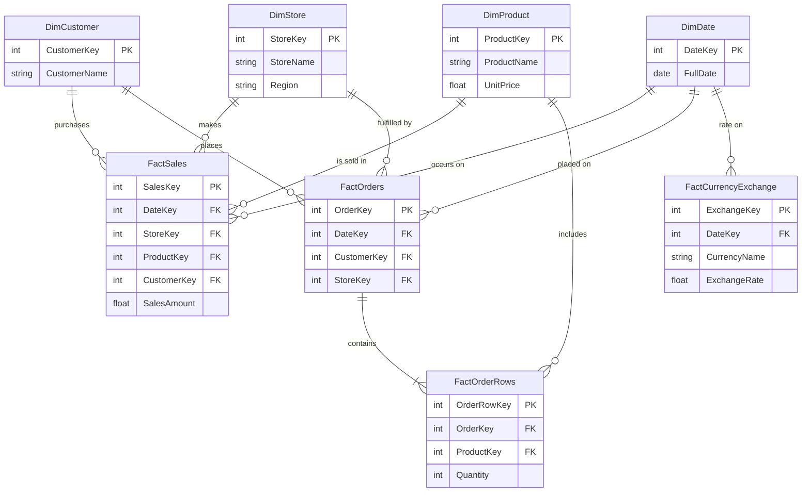

# Contoso Entity-Relationship Diagram

This diagram maps out the Galaxy Schema of the Contoso dataset, demonstrating how the fact tables (events) are linked to the dimension tables (entities) through foreign keys.

